<!-- ABOUT ME -->

  <h2>👋 About Me</h2>

  I'm a <b>final year Information Systems student</b> at Insitut Teknologi Sepuluh Nopember.
  I love building <b>data-driven and machine-learning industrial solutions</b>, i also explore <b>AI implementations</b>.

 

<table>
<tr>
<td align="center">

 
<small>
Github stats
</small>

</td>
<td align="center">

 
<small>
Top languages
</small>

</td>
</tr>
<tr>
<td align="center" colspan="2">

 
<small>
WakaTime stats
</small>

</td>
</tr>
</table>

